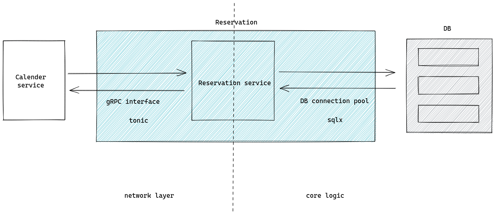

# Core Reservation

- Feature Name: core-reservation
- Start Date: 2022-10-14

## Summary

A core reservation service that solves the problem of reserving a resource for a period of time. We leverage postgresql EXCLUDE constraints to ensure that only one reservation can be made for a given resource in a given time.

## Motivation

We need a common solution for various reservation requirements:

1. calendar booking
2. meeting room booking
3. hotel booking
4. parking lot booking
5. etc.

Repeatedly building features for these requirements is a waste of time and resources. We should have a common solution that can be used by all teams.

## Guide-level explanation

Basic architecture:


### Service interface

We would use gRPC as a service interface. Below is the proto definition:

```protobuf
syntax = "proto3";

enum ReservationStatus{
  UNKNOWN = 0;
  PENDING = 1;
  CONFIRMED = 2;
  BLOCKED = 3;
}

enum ReservationChangeType {
  UNKNOWN = 0;
  CREATE = 1;
  UPDATE = 2;
  DELETE = 3;
}

message Reservation {
  string id = 1;
  string user_id = 2;
  ReservationStatus status = 3;

  string resource_id = 4;
  google.protobuf.Timestamp start = 5;
  google.protobuf.Timestamp end = 6;

  string note = 7;
}

message ReserveRequest{
  Reservation reservation = 1;
}

message ReserveResponse{
  Reservation reservation = 1;
}

message UpdateRequest{
  string note = 1;
}

message UpdateResponse{
  Reservation reservation = 1;
}

message ConfirmRequest{
  string id = 1;
}

message ConfirmResponse{
  Reservation reservation = 1;
}

message CancelRequest{
  string id = 1;
}

message CancelResponse{
  Reservation reservation = 1;
}

message GetRequest{
  string id = 1;
}

message GetResponse{
  Reservation reservation = 1;
}

message QueryRequest{
  string resource_id = 1;
  string user_id = 2;
  // use status to filter result. If UNKNOWN, return all reservations.
  ReservationStatus stauts = 3;
  google.protobuf.Timestamp start = 4;
  google.protobuf.Timestamp end = 5;
}

message ListenRequest{}

message ListenResponse{
  ReservationChangeType op = 1;
  Reservation reservation = 2;
}

service ReservationService {
  rpc reserve(ReserveRequest) returns (ReserveResponse);
  rpc update(UpdateRequest) returns (UpdateResponse);
  rpc confirm(ConfirmRequest) returns (ConfirmResponse);
  rpc cancel(CancelRequest) returns (CancelResponse);
  rpc get(GetRequest) returns (GetResponse);
  rpc query(QueryRequest) returns (stream Reservation);
  // another system could monitor newly add/confirmed/cancelled reservations
  rpc listen(ListenRequest) returns (stream Reservation);
}
```

### Database schema

We use postgres as the database. Below is the schema:

```sql
CREATE SCHEMA resv;

CREATE TYPE resv.reservation_status AS ENUM ('unknown', 'pending', 'confirmed', 'blocked');
CREATE TYPE resv.reservation_change_type AS ENUM ('unknown', 'create', 'update', 'delete');

CREATE TABLE resv.reservations {
  id uuid NOT NULL DEFAULT uuid_generate_v4(),
  user_id VARCHAR(64) NOT NULL,
  status resv.reservation_status NOT NULL DEFAULT 'pending',

  resource_id VARCHAR(64) NOT NULL,
  timespan TSTZRANGE NOT NULL,
  note TEXT,

  CONSTRAINT reservations_pkey PRIMARY KEY (id),
  CONSTRAINT reservations_conflict EXCLUDE USING gist(resource_id WITH =, timespan WITH &&)
};

CREATE INDEX reservations_resource_id_idx ON resv.reservations (resource_id);
CREATE INDEX reservations_user_id_idx ON resv.reservations (user_id);

-- if user_id is null, find all reservations within during for the resource
-- if resource_id is null, find all reservations within during for the user
-- if both are null, find all reservations within during
-- if both are set, find all reservations within during for the resource and user
CREATE OR REPLACE FUNCTION resv.query(user_id TEXT, resource_id TEXT, during TSTZRANGE) RETURNS TABLE resv.reversations AS $$ $$ LANGUAGE plpgsql;

-- reservation change queue
CREATE TABLE resv.reservation_changes {
  id SERIAL NOT NULL,
  reservation_id uuid NOT NULL,
  op resv.reservation_change_type NOT NULL,
};

-- trigger for add/update/delete a reservation
CREATE OR REPLACE FUNCTION resv.reservations_trigger() RETURNS TRIGGER AS $$
BEGIN
  IF TG_OP = 'INSERT' THEN
    -- update reservation_changes
    INSERT INTO resv.reservation_changes (reservation_id, op) VALUES (NEW.id, 'create');
  ELSIF TG_OP = 'UPDATE' THEN
    -- if status changed, update reservation_changes
    IF OLD.status <> NEW.status THEN
      INSERT INTO resv.reservation_changes (reservation_id, op) VALUES (NEW.id, 'update');
    END IF;
  ELSIF TG_OP = 'DELETE' THEN
    -- update reservation_changes
    INSERT INTO resv.reservation_changes (reservation_id, op) VALUES (NEW.id, 'delete');
  END IF;
  -- notify a channel called reservation_update
  NOTIFY reservation_update;
  RETURN NULL;
END;
$$ LANGUAGE plpgsql;

CREATE TRIGGER reservations_trigger
    AFTER INSERT OR UPDATE OR DELETE ON resv.reservations
    FOR EACH ROW EXECUTE PROCEDURE resv.reservations_trigger();
```

Here we use EXCLUDE constraint provided by postgres to ensure that on overlapping reservations cannot be made for a given resource at a given time.

```sql
CONSTRAINT reservations_conflict EXCLUDE USING gist(resource_id WITH =, timespan WITH &&)
```

## Reference-level explanation

TBD(*What's this?*)

## Drawbacks

N/A

## Rationale and alternatives

N/A

## Prior art

N/A

## Unresolved questions

N/A

## Future possibilities

TBD
